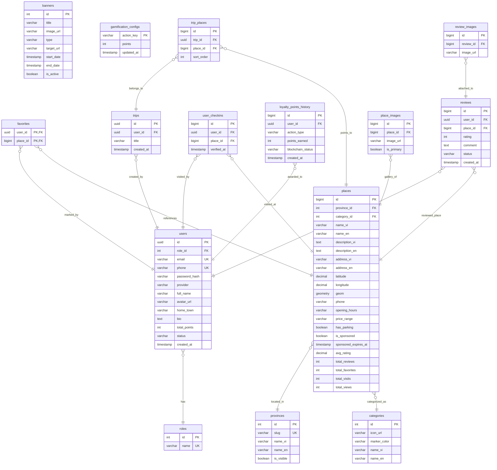

# Tài liệu Thiết kế & Kiến trúc Cơ sở dữ liệu 🇻🇳

Tài liệu này mô tả chi tiết thiết kế lược đồ cơ sở dữ liệu (Database Schema), sơ đồ quan hệ thực thể (ERD), đặc tả các bảng dữ liệu, và các kỹ thuật xử lý không gian địa lý (PostGIS) kết hợp với tính nhất quán ACID trong ứng dụng TravelApp.

---

## 📖 Mục lục
1. [Kiến trúc & Công nghệ](#1-kiến-trúc--công-nghệ)
2. [Sơ đồ quan hệ thực thể (ERD)](#2-sơ-đồ-quan-hệ-thực-thể-erd)
3. [Đặc tả chi tiết các Bảng dữ liệu](#3-đặc-tả-chi-tiết-các-bảng-dữ-liệu)
   - [Bảng `users`](#1-bảng-users)
   - [Bảng `roles`](#2-bảng-roles)
   - [Bảng `places`](#3-bảng-places)
   - [Bảng `categories`](#4-bảng-categories)
   - [Bảng `provinces`](#5-bảng-provinces)
   - [Bảng `favorites`](#6-bảng-favorites)
   - [Bảng `trips`](#7-bảng-trips)
   - [Bảng `trip_places`](#8-bảng-trip_places)
   - [Bảng `user_checkins`](#9-bảng-user_checkins)
   - [Bảng `loyalty_points_history`](#10-bảng-loyalty_points_history)
   - [Bảng `reviews`](#11-bảng-reviews)
   - [Bảng `review_images`](#12-bảng-review_images)
   - [Bảng `place_images`](#13-bảng-place_images)
   - [Bảng `banners`](#14-bảng-banners)
   - [Bảng `gamification_configs`](#15-bảng-gamification_configs)
4. [Tích hợp PostGIS (Dữ liệu địa lý)](#4-tích-hợp-postgis-dữ-liệu-địa-lý)
5. [Đảm bảo tính nhất quán qua ACID Transactions](#5-đảm-bảo-tính-nhất-quán-qua-acid-transactions)
6. [Cơ chế Xóa dây chuyền (Cascade Deletion Paths)](#6-cơ-chế-xóa-dây-chuyền-cascade-deletion-paths)

---

## 1. Kiến trúc & Công nghệ

Hệ thống lưu trữ sử dụng cơ sở dữ liệu quan hệ kết hợp các tính năng nâng cao phục vụ cho ứng dụng bản đồ:

*   **Database Engine**: PostgreSQL v15+
*   **Geospatial Extension**: **PostGIS** được kích hoạt để lưu trữ và tính toán khoảng cách địa lý (tọa độ GPS).
*   **Schema Manager & Client**: **Prisma ORM** quản lý cấu trúc bảng qua file `schema.prisma`.
*   **Engine Type**: Sử dụng driver adapter `@prisma/adapter-pg` cùng `node-postgres` Connection Pool nhằm đáp ứng việc kết nối trực tiếp không qua Rust-binary trong Prisma 7.

---

## 2. Sơ đồ quan hệ thực thể (ERD)

Dưới đây là sơ đồ quan hệ giữa 15 thực thể chính trong hệ thống TravelApp:



---

## 3. Đặc tả chi tiết các Bảng dữ liệu

### 1. Bảng `users`
Lưu trữ thông tin tài khoản người dùng và tích lũy điểm thưởng thành viên.

*   **Tên Model trong Prisma**: `users`
*   **Cấu trúc cột**:

| Tên cột | Kiểu dữ liệu (SQL) | Kiểu Prisma | Ràng buộc | Mô tả |
| :--- | :--- | :--- | :--- | :--- |
| `id` | `uuid` | `String` | `PK`, `default: gen_random_uuid()` | Khóa chính dạng UUID |
| `role_id` | `integer` | `Int` | `FK`, `default: 2` | Tham chiếu tới bảng `roles(id)` |
| `email` | `varchar(255)` | `String?` | `Unique` | Địa chỉ email đăng nhập |
| `phone` | `varchar(20)` | `String?` | `Unique` | Số điện thoại đăng nhập |
| `password_hash` | `varchar(255)` | `String?` | | Mật khẩu băm (bcrypt) |
| `provider` | `varchar(20)` | `String` | `default: "credentials"` | Nhà cung cấp auth (`credentials`, `google`) |
| `full_name` | `varchar(100)` | `String` | | Họ tên người dùng |
| `avatar_url` | `varchar(255)` | `String?` | | Đường dẫn ảnh đại diện |
| `home_town` | `varchar(100)` | `String?` | | Quê quán |
| `bio` | `text` | `String?` | | Tiểu sử ngắn |
| `total_points` | `integer` | `Int` | `default: 0` | Tổng điểm thưởng hiện tại |
| `status` | `varchar(20)` | `String` | `default: "active"` | Trạng thái (`active`, `banned`) |
| `created_at` | `timestamptz` | `DateTime?` | `default: now()` | Thời gian khởi tạo |

---

### 2. Bảng `roles`
Quản trị các vai trò trong hệ thống để thực hiện phân quyền dựa trên vai trò (RBAC).

*   **Tên Model trong Prisma**: `roles`
*   **Cấu trúc cột**:

| Tên cột | Kiểu dữ liệu (SQL) | Kiểu Prisma | Ràng buộc | Mô tả |
| :--- | :--- | :--- | :--- | :--- |
| `id` | `integer` | `Int` | `PK`, `autoincrement()` | Mã vai trò (1: Admin, 2: User, 3: Staff) |
| `name` | `varchar(50)` | `String` | `Unique` | Tên vai trò (`admin`, `user`, `staff`) |

---

### 3. Bảng `places`
Bảng trung tâm lưu trữ thông tin địa điểm du lịch, tọa độ địa lý hình học và bộ đếm tổng hợp.

*   **Tên Model trong Prisma**: `places`
*   **Cấu trúc cột**:

| Tên cột | Kiểu dữ liệu (SQL) | Kiểu Prisma | Ràng buộc | Mô tả |
| :--- | :--- | :--- | :--- | :--- |
| `id` | `bigint` | `BigInt` | `PK`, `autoincrement()` | Khóa chính kiểu BigInt |
| `province_id` | `integer` | `Int` | `FK` | Tham chiếu tới `provinces(id)` |
| `category_id` | `integer` | `Int` | `FK` | Tham chiếu tới `categories(id)` |
| `name_vi` | `varchar(255)` | `String` | | Tên địa điểm tiếng Việt |
| `name_en` | `varchar(255)` | `String` | | Tên địa điểm tiếng Anh |
| `description_vi` | `text` | `String` | | Mô tả tiếng Việt |
| `description_en` | `text` | `String` | | Mô tả tiếng Anh |
| `address_vi` | `varchar(255)` | `String` | | Địa chỉ tiếng Việt |
| `address_en` | `varchar(255)` | `String` | | Địa chỉ tiếng Anh |
| `latitude` | `numeric(10,8)` | `Decimal` | | Tọa độ Vĩ độ |
| `longitude` | `numeric(11,8)` | `Decimal` | | Tọa độ Kinh độ |
| `geom` | `geometry(Point, 4326)` | `Unsupported` | | Đối tượng hình học PostGIS |
| `phone` | `varchar(20)` | `String?` | | Số điện thoại liên hệ |
| `opening_hours` | `varchar(255)` | `String?` | | Khung giờ mở cửa |
| `price_range` | `varchar(100)` | `String?` | | Khoảng giá tham khảo |
| `has_parking` | `boolean` | `Boolean` | `default: false` | Có bãi đỗ xe không |
| `is_sponsored` | `boolean` | `Boolean` | `default: false` | Có được tài trợ quảng bá |
| `sponsored_expires_at`| `timestamptz` | `DateTime?` | | Thời điểm hết hạn tài trợ |
| `avg_rating` | `numeric(2,1)` | `Decimal` | `default: 0.0` | Điểm đánh giá trung bình |
| `total_reviews` | `integer` | `Int` | `default: 0` | Bộ đếm tổng số đánh giá |
| `total_favorites` | `integer` | `Int` | `default: 0` | Bộ đếm số lượt thích |
| `total_visits` | `integer` | `Int` | `default: 0` | Bộ đếm số lượt check-in ghé thăm |
| `total_views` | `integer` | `Int` | `default: 0` | Bộ đếm số lượt xem chi tiết |

*   **Chỉ mục (Indexes)**:
    - `idx_places_province`: B-Tree trên `province_id`
    - `idx_places_category`: B-Tree trên `category_id`
    - `idx_places_geom`: GIST trên cột không gian `geom` (phục vụ tìm kiếm bán kính/khoảng cách nhanh)

---

### 4. Bảng `categories`
Phân loại địa điểm (ví dụ: Di tích, Cà phê, Nhà hàng, Công viên...).

*   **Tên Model trong Prisma**: `categories`
*   **Cấu trúc cột**:

| Tên cột | Kiểu dữ liệu (SQL) | Kiểu Prisma | Ràng buộc | Mô tả |
| :--- | :--- | :--- | :--- | :--- |
| `id` | `integer` | `Int` | `PK`, `autoincrement()` | Khóa chính |
| `icon_url` | `varchar(255)` | `String` | | Đường dẫn icon hiển thị |
| `marker_color` | `varchar(7)` | `String` | | Mã màu Hex của marker bản đồ |
| `name_vi` | `varchar(100)` | `String` | | Tên danh mục tiếng Việt |
| `name_en` | `varchar(100)` | `String` | | Tên danh mục tiếng Anh |

---

### 5. Bảng `provinces`
Khu vực địa giới tỉnh/thành phố để lọc địa điểm.

*   **Tên Model trong Prisma**: `provinces`
*   **Cấu trúc cột**:

| Tên cột | Kiểu dữ liệu (SQL) | Kiểu Prisma | Ràng buộc | Mô tả |
| :--- | :--- | :--- | :--- | :--- |
| `id` | `integer` | `Int` | `PK`, `autoincrement()` | Khóa chính |
| `slug` | `varchar(100)` | `String` | `Unique` | Chuỗi định danh không dấu dạng URL |
| `name_vi` | `varchar(100)` | `String` | | Tên tỉnh tiếng Việt |
| `name_en` | `varchar(100)` | `String` | | Tên tỉnh tiếng Anh |
| `is_visible` | `boolean` | `Boolean` | `default: true` | Có cho phép hiển thị ở client |

---

### 6. Bảng `favorites`
Lưu trữ danh sách địa điểm yêu thích của người dùng. Mối quan hệ nhiều-nhiều giữa `users` và `places`.

*   **Tên Model trong Prisma**: `favorites`
*   **Cấu trúc cột**:

| Tên cột | Kiểu dữ liệu (SQL) | Kiểu Prisma | Ràng buộc | Mô tả |
| :--- | :--- | :--- | :--- | :--- |
| `user_id` | `uuid` | `String` | `PK`, `FK`, `onDelete: Cascade` | Khóa chính ngoại liên kết tới `users(id)` |
| `place_id` | `bigint` | `BigInt` | `PK`, `FK`, `onDelete: Cascade` | Khóa chính ngoại liên kết tới `places(id)` |

---

### 7. Bảng `trips`
Chứa các chuyến đi (hành trình du lịch cá nhân) do người dùng lập kế hoạch.

*   **Tên Model trong Prisma**: `trips`
*   **Cấu trúc cột**:

| Tên cột | Kiểu dữ liệu (SQL) | Kiểu Prisma | Ràng buộc | Mô tả |
| :--- | :--- | :--- | :--- | :--- |
| `id` | `uuid` | `String` | `PK`, `default: gen_random_uuid()` | Mã chuyến đi UUID |
| `user_id` | `uuid` | `String` | `FK`, `onDelete: Cascade` | Khóa ngoại liên kết tới `users(id)` |
| `title` | `varchar(150)` | `String` | | Tên chuyến đi của người dùng |
| `created_at` | `timestamptz` | `DateTime?` | `default: now()` | Thời gian tạo |

---

### 8. Bảng `trip_places`
Bảng trung gian thể hiện thứ tự các địa điểm du lịch nằm trong một chuyến đi cụ thể (`trips`).

*   **Tên Model trong Prisma**: `trip_places`
*   **Cấu trúc cột**:

| Tên cột | Kiểu dữ liệu (SQL) | Kiểu Prisma | Ràng buộc | Mô tả |
| :--- | :--- | :--- | :--- | :--- |
| `id` | `bigint` | `BigInt` | `PK`, `autoincrement()` | Khóa chính |
| `trip_id` | `uuid` | `String` | `FK`, `onDelete: Cascade` | Khóa ngoại liên kết tới `trips(id)` |
| `place_id` | `bigint` | `BigInt` | `FK`, `onDelete: Cascade` | Khóa ngoại liên kết tới `places(id)` |
| `sort_order` | `integer` | `Int` | `default: 0` | Thứ tự ghé thăm trong chuyến đi |

*   **Chỉ mục (Indexes)**:
    - `idx_trip_places_trip`: B-Tree trên cột `trip_id` giúp tối ưu hóa truy vấn các điểm của một hành trình.

---

### 9. Bảng `user_checkins`
Nhật ký ghi lại các lượt người dùng điểm danh (Check-in) khi ghé thăm địa điểm.

*   **Tên Model trong Prisma**: `user_checkins`
*   **Cấu trúc cột**:

| Tên cột | Kiểu dữ liệu (SQL) | Kiểu Prisma | Ràng buộc | Mô tả |
| :--- | :--- | :--- | :--- | :--- |
| `id` | `bigint` | `BigInt` | `PK`, `autoincrement()` | Khóa chính |
| `user_id` | `uuid` | `String` | `FK`, `onDelete: Cascade` | Khóa ngoại tới `users(id)` |
| `place_id` | `bigint` | `BigInt` | `FK`, `onDelete: Cascade` | Khóa ngoại tới `places(id)` |
| `verified_at` | `timestamptz` | `DateTime?` | `default: now()` | Thời gian xác thực check-in |

---

### 10. Bảng `loyalty_points_history`
Lưu trữ lịch sử tích lũy điểm thưởng thành viên qua các hành động cụ thể.

*   **Tên Model trong Prisma**: `loyalty_points_history`
*   **Cấu trúc cột**:

| Tên cột | Kiểu dữ liệu (SQL) | Kiểu Prisma | Ràng buộc | Mô tả |
| :--- | :--- | :--- | :--- | :--- |
| `id` | `bigint` | `BigInt` | `PK`, `autoincrement()` | Khóa chính |
| `user_id` | `uuid` | `String` | `FK`, `onDelete: Cascade` | Khóa ngoại liên kết tới `users(id)` |
| `action_type` | `varchar(50)` | `String` | | Loại hành động (vd: `review_place`, `checkin`) |
| `points_earned` | `integer` | `Int` | | Số điểm được cộng (hoặc trừ nếu âm) |
| `blockchain_status`| `varchar(20)`| `String` | `default: "none"` | Trạng thái đồng bộ blockchain (`none`, `pending`, `success`) |
| `created_at` | `timestamptz` | `DateTime?` | `default: now()` | Thời gian ghi nhận |

*   **Chỉ mục (Indexes)**:
    - `idx_loyalty_history_user`: B-Tree trên `user_id` giúp tối ưu hóa hiển thị trang lịch sử điểm.

---

### 11. Bảng `reviews`
Đánh giá và bình luận của người dùng về địa điểm du lịch.

*   **Tên Model trong Prisma**: `reviews`
*   **Cấu trúc cột**:

| Tên cột | Kiểu dữ liệu (SQL) | Kiểu Prisma | Ràng buộc | Mô tả |
| :--- | :--- | :--- | :--- | :--- |
| `id` | `bigint` | `BigInt` | `PK`, `autoincrement()` | Khóa chính |
| `user_id` | `uuid` | `String` | `FK`, `onDelete: Cascade` | Khóa ngoại liên kết tới `users(id)` |
| `place_id` | `bigint` | `BigInt` | `FK`, `onDelete: Cascade` | Khóa ngoại liên kết tới `places(id)` |
| `rating` | `integer` | `Int` | `check: 1 <= rating <= 5` | Điểm đánh giá (1-5 sao) |
| `comment` | `text` | `String` | | Nội dung đánh giá |
| `status` | `varchar(20)` | `String` | `default: "approved"` | Trạng thái phê duyệt bình luận |
| `created_at` | `timestamptz` | `DateTime?` | `default: now()` | Thời điểm đánh giá |

*   **Chỉ mục (Indexes)**:
    - `idx_reviews_place`: B-Tree trên cột `place_id` tối ưu hiển thị danh sách đánh giá của địa điểm.

---

### 12. Bảng `review_images`
Ảnh đính kèm theo bài đánh giá của người dùng.

*   **Tên Model trong Prisma**: `review_images`
*   **Cấu trúc cột**:

| Tên cột | Kiểu dữ liệu (SQL) | Kiểu Prisma | Ràng buộc | Mô tả |
| :--- | :--- | :--- | :--- | :--- |
| `id` | `bigint` | `BigInt` | `PK`, `autoincrement()` | Khóa chính |
| `review_id` | `bigint` | `BigInt` | `FK`, `onDelete: Cascade` | Khóa ngoại liên kết tới `reviews(id)` |
| `image_url` | `varchar(255)` | `String` | | URL ảnh trên cloud storage |

---

### 13. Bảng `place_images`
Bộ sưu tập ảnh trưng bày cho địa điểm du lịch.

*   **Tên Model trong Prisma**: `place_images`
*   **Cấu trúc cột**:

| Tên cột | Kiểu dữ liệu (SQL) | Kiểu Prisma | Ràng buộc | Mô tả |
| :--- | :--- | :--- | :--- | :--- |
| `id` | `bigint` | `BigInt` | `PK`, `autoincrement()` | Khóa chính |
| `place_id` | `bigint` | `BigInt` | `FK`, `onDelete: Cascade` | Khóa ngoại liên kết tới `places(id)` |
| `image_url` | `varchar(255)` | `String` | | URL ảnh của địa điểm |
| `is_primary` | `boolean` | `Boolean` | `default: false` | Có phải ảnh chính đại diện không |

*   **Chỉ mục (Indexes)**:
    - `idx_place_images_place`: B-Tree trên cột `place_id` phục vụ load nhanh album ảnh của một địa điểm.

---

### 14. Bảng `banners`
Lưu trữ thông tin về các banner quảng cáo hoặc thông điệp khuyến mại hiển thị trên ứng dụng.

*   **Tên Model trong Prisma**: `banners`
*   **Cấu trúc cột**:

| Tên cột | Kiểu dữ liệu (SQL) | Kiểu Prisma | Ràng buộc | Mô tả |
| :--- | :--- | :--- | :--- | :--- |
| `id` | `integer` | `Int` | `PK`, `autoincrement()` | Khóa chính |
| `title` | `varchar(150)` | `String` | | Tiêu đề của banner |
| `image_url` | `varchar(255)` | `String` | | URL hình ảnh banner |
| `type` | `varchar(20)` | `String` | | Loại banner (ví dụ: `home`, `destination`) |
| `target_url` | `varchar(255)` | `String?` | | Đường dẫn chuyển hướng khi click banner |
| `start_date` | `timestamptz` | `DateTime` | | Thời điểm bắt đầu hiển thị |
| `end_date` | `timestamptz` | `DateTime` | | Thời điểm kết thúc hiển thị |
| `is_active` | `boolean` | `Boolean` | `default: true` | Trạng thái hiển thị (đang hoạt động / tắt) |

---

### 15. Bảng `gamification_configs`
Cấu hình hệ thống điểm thưởng của các thao tác tương tác của thành viên.

*   **Tên Model trong Prisma**: `gamification_configs`
*   **Cấu trúc cột**:

| Tên cột | Kiểu dữ liệu (SQL) | Kiểu Prisma | Ràng buộc | Mô tả |
| :--- | :--- | :--- | :--- | :--- |
| `action_key` | `varchar(50)` | `String` | `PK` | Khóa định danh hành động (ví dụ: `review_place`, `checkin`) |
| `points` | `integer` | `Int` | | Số điểm tích lũy được gán cho hành động này |
| `updated_at` | `timestamptz` | `DateTime?` | `default: now()` | Thời gian cập nhật cấu hình cuối cùng |

---

## 4. Tích hợp PostGIS (Dữ liệu địa lý)

Một tính năng đặc biệt của Database ứng dụng là cột tọa độ địa lý `geom` thuộc kiểu hình học không gian PostGIS trong bảng `places`:
```sql
geom geometry(Geometry, 4326) NOT NULL
```
### Cơ chế lưu trữ & Định vị:
1.  **Hệ tọa độ SRID 4326 (WGS 84)**: Sử dụng chuẩn tọa độ GPS toàn cầu (kinh độ, vĩ độ).
2.  **Raw SQL do Prisma không hỗ trợ**: Do kiểu `geometry` được Prisma ORM ánh xạ thành `Unsupported("geometry")` và không thể thao tác chèn/sửa đổi trực tiếp qua các hàm Prisma Client API thông thường. Lớp `PlaceService` thực hiện lưu trữ thông qua hàm raw query để tận dụng trực tiếp hàm hình học của PostGIS:
    ```javascript
    await prisma.$queryRaw`
      INSERT INTO places (..., geom) 
      VALUES (..., ST_SetSRID(ST_MakePoint(${longitude}, ${latitude}), 4326))
    `;
    ```
    - `ST_MakePoint(lon, lat)`: Tạo thực thể điểm (Point) dựa vào Kinh độ và Vĩ độ được truyền vào.
    - `ST_SetSRID(point, 4326)`: Gán hệ quy chiếu không gian GPS toàn cầu (chuẩn WGS 84) cho điểm vừa tạo.
3.  **Spatial Indexing**: Sử dụng chỉ mục loại `Gist` trên cột `geom` (`idx_places_geom`) trong Postgres để giúp tối ưu hóa tuyệt đối tốc độ tính toán khi người dùng thực hiện lọc tìm các địa điểm du lịch nằm trong một bán kính nhất định (vd: 5km xung quanh vị trí hiện tại của thiết bị).

---

## 5. Đảm bảo tính nhất quán qua ACID Transactions

Để tối ưu hóa hiệu năng đọc của ứng dụng ở client, cơ sở dữ liệu duy trì một số trường tổng hợp (bộ đếm gộp) như `places.total_favorites` hoặc `users.total_points`. Để các bộ đếm này không bao giờ bị sai lệch (lệch pha dữ liệu), phần backend thực hiện ghi thông qua **Prisma ACID Transactions** (`prisma.$transaction`).

### Ví dụ 1: Đồng bộ hóa lượt Yêu thích (`total_favorites`)
Khi một người dùng thả tim địa điểm, hệ thống thực thi hai tác vụ trong một giao dịch duy nhất. Nếu một trong hai lệnh lỗi, toàn bộ thao tác sẽ được rollback để tránh lỗi bộ đếm:
```javascript
return await prisma.$transaction(async (tx) => {
  // 1. Tạo bản ghi favorites
  const favorite = await tx.favorites.create({
    data: { user_id, place_id: placeId }
  });

  // 2. Tăng số lượt favorites của địa điểm tương ứng (+1)
  await tx.places.update({
    where: { id: placeId },
    data: {
      total_favorites: { increment: 1 }
    }
  });

  return favorite;
});
```

### Ví dụ 2: Cộng/Trừ Điểm thưởng đồng bộ (`total_points`)
Khi quản trị viên trao điểm hoặc hủy bỏ một giao dịch tích điểm của khách hàng, tổng điểm hiển thị của người dùng trong bảng `users` luôn được đồng bộ an toàn:
```javascript
await prisma.$transaction(async (tx) => {
  // 1. Xóa dòng lịch sử điểm trong loyalty_points_history
  await tx.loyalty_points_history.delete({
    where: { id: historyId }
  });

  // 2. Khấu trừ điểm tích lũy của user tương ứng trong users
  await tx.users.update({
    where: { id: history.user_id },
    data: {
      total_points: { decrement: history.points_earned }
    }
  });
});
```

---

## 6. Cơ chế Xóa dây chuyền (Cascade Deletion Paths)

Để bảo đảm tính toàn vẹn tham chiếu (Referential Integrity) và tránh dữ liệu mồ côi (orphan records), cơ sở dữ liệu đã thiết lập các ràng buộc khóa ngoại có hành vi `onDelete: Cascade`.

### 1. Khi xóa một `User` (Người dùng):
```text
[users (Xóa)]
  ├── (Cascade) ──> [favorites] (Xóa các địa điểm yêu thích của người dùng)
  ├── (Cascade) ──> [trips] (Xóa toàn bộ hành trình chuyến đi tự lập)
  │                   └── (Cascade) ──> [trip_places] (Xóa các điểm lưu trong hành trình)
  ├── (Cascade) ──> [user_checkins] (Xóa lịch sử check-in của người dùng này)
  ├── (Cascade) ──> [reviews] (Xóa tất cả các bài đánh giá)
  │                   └── (Cascade) ──> [review_images] (Xóa ảnh đính kèm theo đánh giá)
  └── (Cascade) ──> [loyalty_points_history] (Xóa lịch sử nhận điểm thưởng)
```

### 2. Khi xóa một `Place` (Địa điểm du lịch):
```text
[places (Xóa)]
  ├── (Cascade) ──> [place_images] (Xóa album ảnh của địa điểm)
  ├── (Cascade) ──> [favorites] (Xóa liên kết yêu thích địa điểm của người dùng)
  ├── (Cascade) ──> [trip_places] (Xóa địa điểm này khỏi tất cả lịch trình đi chơi)
  ├── (Cascade) ──> [user_checkins] (Xóa dữ liệu ghi nhận check-in tại đây)
  └── (Cascade) ──> [reviews] (Xóa các bài đánh giá viết cho địa điểm này)
                      └── (Cascade) ──> [review_images] (Xóa ảnh kèm theo đánh giá)
```
> [!WARNING]
> Hành động xóa `Place` hoặc `User` là không thể khôi phục và sẽ dọn sạch toàn bộ các thực thể liên quan đến chúng ở nhánh tương ứng.
