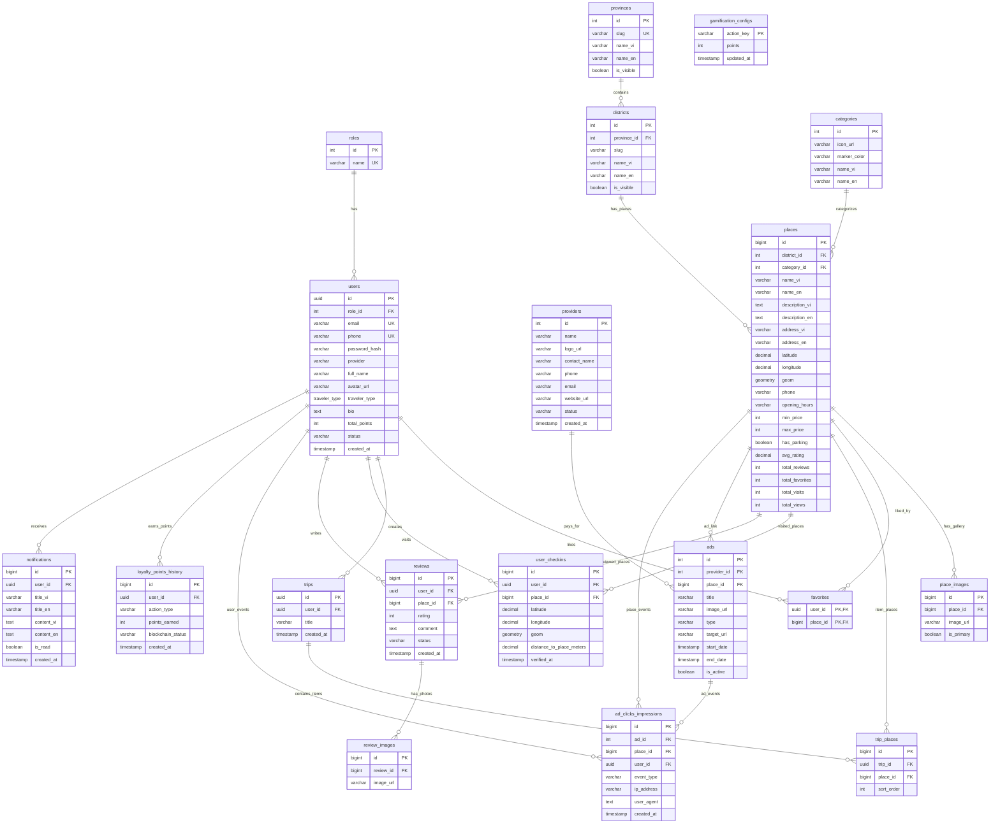

# Tài liệu Thiết kế & Kiến trúc Cơ sở dữ liệu 🇻🇳
**Dự án**: Mekong Ơi

Tài liệu này mô tả chi tiết thiết kế lược đồ cơ sở dữ liệu (Database Schema), sơ đồ quan hệ thực thể (ERD), đặc tả các bảng dữ liệu, và các kỹ thuật xử lý không gian địa lý (PostGIS) kết hợp với tính nhất quán trong ứng dụng Mekong Ơi.

---

## 📖 Mục lục
1. [Kiến trúc & Công nghệ](#1-kiến-trúc--công-nghệ)
2. [Sơ đồ quan hệ thực thể (ERD)](#2-sơ-đồ-quan-hệ-thực-thể-erd)
3. [Đặc tả chi tiết các Bảng dữ liệu](#3-đặc-tả-chi-tiết-các-bảng-dữ-liệu)
   - [Bảng `users`](#1-bảng-users)
   - [Bảng `roles`](#2-bảng-roles)
   - [Bảng `providers`](#3-bảng-providers)
   - [Bảng `provinces`](#4-bảng-provinces)
   - [Bảng `districts`](#5-bảng-districts)
   - [Bảng `categories`](#6-bảng-categories)
   - [Bảng `places`](#7-bảng-places)
   - [Bảng `place_images`](#8-bảng-place_images)
   - [Bảng `favorites`](#9-bảng-favorites)
   - [Bảng `trips`](#10-bảng-trips)
   - [Bảng `trip_places`](#11-bảng-trip_places)
   - [Bảng `user_checkins`](#12-bảng-user_checkins)
   - [Bảng `reviews`](#13-bảng-reviews)
   - [Bảng `review_images`](#14-bảng-review_images)
   - [Bảng `ads`](#15-bảng-ads)
   - [Bảng `ad_clicks_impressions`](#16-bảng-ad_clicks_impressions)
   - [Bảng `gamification_configs`](#17-bảng-gamification_configs)
   - [Bảng `loyalty_points_history`](#18-bảng-loyalty_points_history)
   - [Bảng `notifications`](#19-bảng-notifications)
4. [Tích hợp PostGIS (Dữ liệu địa lý)](#4-tích-hợp-postgis-dữ-liệu-địa-lý)

---

## 1. Kiến trúc & Công nghệ

Hệ thống lưu trữ sử dụng cơ sở dữ liệu quan hệ kết hợp các tính năng nâng cao phục vụ cho ứng dụng bản đồ:

*   **Database Engine**: PostgreSQL v17
*   **Geospatial Extension**: **PostGIS** được kích hoạt để lưu trữ và tính toán khoảng cách địa lý (tọa độ GPS).
*   **Schema Manager & Client**: **Prisma ORM** quản lý cấu trúc bảng qua file `schema.prisma`.

---

## 2. Sơ đồ quan hệ thực thể (ERD)
Dưới đây là sơ đồ quan hệ của toàn bộ 19 thực thể trong hệ thống Mekong Ơi:



---

## 3. Đặc tả chi tiết các Bảng dữ liệu

### 1. Bảng `users`
Lưu trữ tài khoản người dùng, tổng điểm thưởng và trạng thái hoạt động.

*   **Tên Model trong Prisma**: `users`
*   **Cấu trúc cột**:

| Tên cột | Kiểu dữ liệu (SQL) | Kiểu Prisma | Ràng buộc | Mô tả |
| :--- | :--- | :--- | :--- | :--- |
| `id` | `uuid` | `String` | `PK`, `default: gen_random_uuid()` | Khóa chính dạng UUID |
| `role_id` | `integer` | `Int` | `FK`, `default: 2` | Liên kết tới `roles(id)` |
| `email` | `varchar(255)` | `String?` | `Unique` | Email đăng nhập |
| `phone` | `varchar(20)` | `String?` | `Unique` | Số điện thoại |
| `password_hash` | `varchar(255)` | `String?` | | Mật khẩu băm |
| `provider` | `varchar(20)` | `String` | `default: 'credentials'` | Phương thức (credentials, google...) |
| `full_name` | `varchar(100)` | `String` | | Họ tên hiển thị |
| `avatar_url` | `varchar(255)` | `String?` | | URL ảnh đại diện |
| `traveler_type` | `traveler_type (enum)` | `TravelerType?` | `default: DOMESTIC` | Loại khách du lịch (`DOMESTIC` / `INTERNATIONAL`) |
| `bio` | `text` | `String?` | | Tiểu sử ngắn |
| `total_points` | `integer` | `Int` | `default: 0` | Điểm tích lũy hiện tại |
| `status` | `varchar(20)` | `String` | `default: 'active'` | Trạng thái (active, banned...) |
| `created_at` | `timestamptz` | `DateTime?` | `default: now()` | Thời gian tạo tài khoản |

---

### 2. Bảng `roles`
Nhóm quyền hạn và phân vai trò người dùng/nhân viên.

*   **Tên Model trong Prisma**: `roles`
*   **Cấu trúc cột**:

| Tên cột | Kiểu dữ liệu (SQL) | Kiểu Prisma | Ràng buộc | Mô tả |
| :--- | :--- | :--- | :--- | :--- |
| `id` | `integer` | `Int` | `PK`, `autoincrement()` | Khóa chính |
| `name` | `varchar(50)` | `String` | `Unique` | Tên vai trò (`admin`, `user`, `staff`) |

---

### 3. Bảng `providers`
Thông tin về các doanh nghiệp đối tác chạy quảng cáo.

*   **Tên Model trong Prisma**: `providers`
*   **Cấu trúc cột**:

| Tên cột | Kiểu dữ liệu (SQL) | Kiểu Prisma | Ràng buộc | Mô tả |
| :--- | :--- | :--- | :--- | :--- |
| `id` | `integer` | `Int` | `PK`, `autoincrement()` | Khóa chính |
| `name` | `varchar(150)` | `String` | `NOT NULL` | Tên nhà cung cấp |
| `logo_url` | `varchar(255)` | `String?` | | URL logo thương hiệu |
| `contact_name` | `varchar(100)` | `String?` | | Tên người liên hệ |
| `phone` | `varchar(20)` | `String?` | | Số điện thoại |
| `email` | `varchar(255)` | `String?` | | Email liên hệ |
| `website_url` | `varchar(255)` | `String?` | | Trang web chính thức |
| `status` | `varchar(20)` | `String` | `CHECK (status IN ('active', 'inactive'))` | Trạng thái hoạt động |
| `created_at` | `timestamptz` | `DateTime?` | `default: now()` | Thời gian tạo |

---

### 4. Bảng `provinces`
Thông tin các Tỉnh/Thành phố thuộc khu vực du lịch.

*   **Tên Model trong Prisma**: `provinces`
*   **Cấu trúc cột**:

| Tên cột | Kiểu dữ liệu (SQL) | Kiểu Prisma | Ràng buộc | Mô tả |
| :--- | :--- | :--- | :--- | :--- |
| `id` | `integer` | `Int` | `PK`, `autoincrement()` | Khóa chính |
| `slug` | `varchar(100)` | `String` | `Unique` | URL-friendly slug |
| `name_vi` | `varchar(100)` | `String` | | Tên Tiếng Việt |
| `name_en` | `varchar(100)` | `String` | | Tên Tiếng Anh |
| `is_visible` | `boolean` | `Boolean` | `default: true` | Có hiển thị ra ngoài không |

---

### 5. Bảng `districts`
Thông tin Quận/Huyện phục vụ bộ lọc tìm kiếm khu vực sâu hơn.

*   **Tên Model trong Prisma**: `districts`
*   **Cấu trúc cột**:

| Tên cột | Kiểu dữ liệu (SQL) | Kiểu Prisma | Ràng buộc | Mô tả |
| :--- | :--- | :--- | :--- | :--- |
| `id` | `integer` | `Int` | `PK`, `autoincrement()` | Khóa chính |
| `province_id` | `integer` | `Int` | `FK`, `onDelete: Cascade` | Khóa ngoại liên kết `provinces(id)` |
| `slug` | `varchar(100)` | `String` | | Đường dẫn tĩnh huyện |
| `name_vi` | `varchar(100)` | `String` | | Tên Quận/Huyện Tiếng Việt |
| `name_en` | `varchar(100)` | `String` | | Tên Quận/Huyện Tiếng Anh |
| `is_visible` | `boolean` | `Boolean` | `default: true` | Trạng thái hiển thị |

---

### 6. Bảng `categories`
Danh mục loại hình của địa điểm (Quán ăn, Cafe, Homestay, Điểm tham quan).

*   **Tên Model trong Prisma**: `categories`
*   **Cấu trúc cột**:

| Tên cột | Kiểu dữ liệu (SQL) | Kiểu Prisma | Ràng buộc | Mô tả |
| :--- | :--- | :--- | :--- | :--- |
| `id` | `integer` | `Int` | `PK`, `autoincrement()` | Khóa chính |
| `icon_url` | `varchar(255)` | `String` | | URL biểu tượng đại diện |
| `marker_color` | `varchar(7)` | `String` | | Mã màu HEX để vẽ Marker bản đồ |
| `name_vi` | `varchar(100)` | `String` | | Tên danh mục Tiếng Việt |
| `name_en` | `varchar(100)` | `String` | | Tên danh mục Tiếng Anh |

---

### 7. Bảng `places`
Bảng lưu trữ thông tin Địa điểm chi tiết (Có liên kết đối tác và địa lý).

*   **Tên Model trong Prisma**: `places`
*   **Cấu trúc cột**:

| Tên cột | Kiểu dữ liệu (SQL) | Kiểu Prisma | Ràng buộc | Mô tả |
| :--- | :--- | :--- | :--- | :--- |
| `id` | `bigint` | `BigInt` | `PK`, `autoincrement()` | Khóa chính |
| `district_id` | `integer` | `Int` | `FK`, `onDelete: Restrict` | Liên kết `districts(id)` |
| `category_id` | `integer` | `Int` | `FK`, `onDelete: Restrict` | Liên kết `categories(id)` |
| `name_vi` | `varchar(255)` | `String` | | Tên Tiếng Việt |
| `name_en` | `varchar(255)` | `String` | | Tên Tiếng Anh |
| `description_vi` | `text` | `String` | | Mô tả chi tiết Tiếng Việt |
| `description_en` | `text` | `String` | | Mô tả chi tiết Tiếng Anh |
| `address_vi` | `varchar(255)` | `String` | | Địa chỉ Tiếng Việt |
| `address_en` | `varchar(255)` | `String` | | Địa chỉ Tiếng Anh |
| `latitude` | `numeric(10,8)` | `Decimal` | | Vĩ độ |
| `longitude` | `numeric(11,8)` | `Decimal` | | Kinh độ |
| `geom` | `geometry(Point, 4326)` | `Unsupported` | | Tọa độ địa lý dùng cho PostGIS |
| `phone` | `varchar(20)` | `String?` | | Số điện thoại liên hệ |
| `opening_hours` | `varchar(255)` | `String?` | | Giờ hoạt động (VD: 07:00 - 21:00) |
| `min_price` | `integer` | `Int?` | | Giá tối thiểu |
| `max_price` | `integer` | `Int?` | | Giá tối đa |
| `has_parking` | `boolean` | `Boolean` | `default: false` | Có bãi đỗ xe không |
| `avg_rating` | `numeric(2,1)` | `Decimal` | `default: 0.0` | Đánh giá trung bình từ reviews |
| `total_reviews` | `integer` | `Int` | `default: 0` | Tổng lượt đánh giá |
| `total_favorites` | `integer` | `Int` | `default: 0` | Tổng lượt yêu thích |
| `total_visits` | `integer` | `Int` | `default: 0` | Tổng lượt check-in |
| `total_views` | `integer` | `Int` | `default: 0` | Tổng lượt xem trang chi tiết |

*   **Chỉ mục (Indexes)**:
    - `idx_places_geom`: Gist index trên cột `geom` để truy vấn không gian.
    - `idx_places_district`: B-Tree trên cột `district_id`.
    - `idx_places_category`: B-Tree trên cột `category_id`.

---

### 8. Bảng `place_images`
Thư viện ảnh của địa điểm du lịch.

*   **Tên Model trong Prisma**: `place_images`
*   **Cấu trúc cột**:

| Tên cột | Kiểu dữ liệu (SQL) | Kiểu Prisma | Ràng buộc | Mô tả |
| :--- | :--- | :--- | :--- | :--- |
| `id` | `bigint` | `BigInt` | `PK`, `autoincrement()` | Khóa chính |
| `place_id` | `bigint` | `BigInt` | `FK`, `onDelete: Cascade` | Khóa ngoại liên kết `places(id)` |
| `image_url` | `varchar(255)` | `String` | | URL ảnh địa điểm |
| `is_primary` | `boolean` | `Boolean` | `default: false` | Ảnh chính đại diện |

---

### 9. Bảng `favorites`
Danh sách các địa điểm được người dùng yêu thích.

*   **Tên Model trong Prisma**: `favorites`
*   **Cấu trúc cột**:

| Tên cột | Kiểu dữ liệu (SQL) | Kiểu Prisma | Ràng buộc | Mô tả |
| :--- | :--- | :--- | :--- | :--- |
| `user_id` | `uuid` | `String` | `PK`, `FK`, `onDelete: Cascade` | Khóa ngoại liên kết `users(id)` |
| `place_id` | `bigint` | `BigInt` | `PK`, `FK`, `onDelete: Cascade` | Khóa ngoại liên kết `places(id)` |

---

### 10. Bảng `trips`
Lịch trình chuyến đi tự chọn được du khách thiết lập.

*   **Tên Model trong Prisma**: `trips`
*   **Cấu trúc cột**:

| Tên cột | Kiểu dữ liệu (SQL) | Kiểu Prisma | Ràng buộc | Mô tả |
| :--- | :--- | :--- | :--- | :--- |
| `id` | `uuid` | `String` | `PK`, `default: gen_random_uuid()` | Khóa chính |
| `user_id` | `uuid` | `String` | `FK`, `onDelete: Cascade` | Khóa ngoại liên kết `users(id)` |
| `title` | `varchar(150)` | `String` | | Tên lịch trình (VD: Phượt An Giang) |
| `created_at` | `timestamptz` | `DateTime?` | `default: now()` | Thời gian tạo |

---

### 11. Bảng `trip_places`
Chi tiết các địa điểm nằm trong một lịch trình.

*   **Tên Model trong Prisma**: `trip_places`
*   **Cấu trúc cột**:

| Tên cột | Kiểu dữ liệu (SQL) | Kiểu Prisma | Ràng buộc | Mô tả |
| :--- | :--- | :--- | :--- | :--- |
| `id` | `bigint` | `BigInt` | `PK`, `autoincrement()` | Khóa chính |
| `trip_id` | `uuid` | `String` | `FK`, `onDelete: Cascade` | Khóa ngoại liên kết `trips(id)` |
| `place_id` | `bigint` | `BigInt` | `FK`, `onDelete: Cascade` | Khóa ngoại liên kết `places(id)` |
| `sort_order` | `integer` | `Int` | `default: 0` | Thứ tự ghé thăm |

---

### 12. Bảng `user_checkins`
Nhật ký du khách check-in tại các địa điểm dựa trên định vị GPS (Xác thực thực tế).

*   **Tên Model trong Prisma**: `user_checkins`
*   **Cấu trúc cột**:

| Tên cột | Kiểu dữ liệu (SQL) | Kiểu Prisma | Ràng buộc | Mô tả |
| :--- | :--- | :--- | :--- | :--- |
| `id` | `bigint` | `BigInt` | `PK`, `autoincrement()` | Khóa chính |
| `user_id` | `uuid` | `String` | `FK`, `onDelete: Cascade` | Khóa ngoại liên kết `users(id)` |
| `place_id` | `bigint` | `BigInt` | `FK`, `onDelete: Cascade` | Khóa ngoại liên kết `places(id)` |
| `latitude` | `numeric(10,8)` | `Decimal?` | | Vĩ độ thời điểm check-in |
| `longitude` | `numeric(11,8)` | `Decimal?` | | Kinh độ thời điểm check-in |
| `geom` | `geometry(Point, 4326)` | `Unsupported?` | | Định vị không gian của điểm check-in (PostGIS) |
| `distance_to_place_meters` | `numeric(10,2)` | `Decimal?` | | Khoảng cách thực tế tới địa điểm (mét) |
| `verified_at` | `timestamptz` | `DateTime?` | `default: now()` | Thời điểm check-in |

---

### 13. Bảng `reviews`
Bài đánh giá chất lượng và chấm sao địa điểm.

*   **Tên Model trong Prisma**: `reviews`
*   **Cấu trúc cột**:

| Tên cột | Kiểu dữ liệu (SQL) | Kiểu Prisma | Ràng buộc | Mô tả |
| :--- | :--- | :--- | :--- | :--- |
| `id` | `bigint` | `BigInt` | `PK`, `autoincrement()` | Khóa chính |
| `user_id` | `uuid` | `String` | `FK`, `onDelete: Cascade` | Khóa ngoại liên kết `users(id)` |
| `place_id` | `bigint` | `BigInt` | `FK`, `onDelete: Cascade` | Khóa ngoại liên kết `places(id)` |
| `rating` | `integer` | `Int` | `CHECK (between 1 and 5)` | Điểm chấm (1-5 sao) |
| `comment` | `text` | `String` | | Nội dung nhận xét |
| `status` | `varchar(20)` | `String` | `default: 'approved'` | Trạng thái (approved, hidden...) |
| `created_at` | `timestamptz` | `DateTime?` | `default: now()` | Ngày viết |

---

### 14. Bảng `review_images`
Hình ảnh người dùng tải lên đính kèm bài đánh giá.

*   **Tên Model trong Prisma**: `review_images`
*   **Cấu trúc cột**:

| Tên cột | Kiểu dữ liệu (SQL) | Kiểu Prisma | Ràng buộc | Mô tả |
| :--- | :--- | :--- | :--- | :--- |
| `id` | `bigint` | `BigInt` | `PK`, `autoincrement()` | Khóa chính |
| `review_id` | `bigint` | `BigInt` | `FK`, `onDelete: Cascade` | Khóa ngoại liên kết `reviews(id)` |
| `image_url` | `varchar(255)` | `String` | | URL hình ảnh |

---

### 15. Bảng `ads`
Thông tin các quảng cáo/tài trợ hiển thị trong app (Liên kết đối tác quảng cáo).

*   **Tên Model trong Prisma**: `ads`
*   **Cấu trúc cột**:

| Tên cột | Kiểu dữ liệu (SQL) | Kiểu Prisma | Ràng buộc | Mô tả |
| :--- | :--- | :--- | :--- | :--- |
| `id` | `integer` | `Int` | `PK`, `autoincrement()` | Khóa chính |
| `provider_id` | `integer` | `Int?` | `FK`, `onDelete: Cascade` | Liên kết đối tác sở hữu |
| `place_id` | `bigint` | `BigInt?` | `FK`, `onDelete: SetNull` | Liên kết địa điểm nội bộ trong app |
| `title` | `varchar(150)` | `String` | | Tiêu đề của quảng cáo |
| `image_url` | `varchar(255)` | `String` | | URL hình ảnh quảng cáo |
| `type` | `varchar(20)` | `String` | | Loại quảng cáo (ví dụ: `home`, `place`, `sponsored`) |
| `target_url` | `varchar(255)` | `String?` | | Đường dẫn chuyển hướng khi click quảng cáo |
| `start_date` | `timestamptz` | `DateTime` | | Thời điểm bắt đầu hiển thị |
| `end_date` | `timestamptz` | `DateTime` | | Thời điểm kết thúc hiển thị |
| `is_active` | `boolean` | `Boolean` | `default: true` | Trạng thái hiển thị |

---

### 16. Bảng `ad_clicks_impressions`
Nhật ký thu thập click và hiển thị phục vụ đo lường hiệu quả quảng cáo của đối tác.

*   **Tên Model trong Prisma**: `ad_clicks_impressions`
*   **Cấu trúc cột**:

| Tên cột | Kiểu dữ liệu (SQL) | Kiểu Prisma | Ràng buộc | Mô tả |
| :--- | :--- | :--- | :--- | :--- |
| `id` | `bigint` | `BigInt` | `PK`, `autoincrement()` | Khóa chính |
| `ad_id` | `integer` | `Int?` | `FK`, `onDelete: Cascade` | Liên kết quảng cáo cụ thể |
| `place_id` | `bigint` | `BigInt?` | `FK`, `onDelete: Cascade` | Liên kết địa điểm tài trợ |
| `user_id` | `uuid` | `String?` | `FK`, `onDelete: SetNull` | Du khách tạo sự kiện |
| `event_type` | `varchar(20)` | `String` | `CHECK (in 'impression', 'click')` | Loại sự kiện |
| `ip_address` | `varchar(45)` | `String?` | | IP thiết bị |
| `user_agent` | `text` | `String?` | | Trình duyệt / OS của người dùng |
| `created_at` | `timestamptz` | `DateTime?` | `default: now()` | Thời gian diễn ra |

---

### 17. Bảng `gamification_configs`
Cấu hình điểm thưởng gán cho các thao tác trên hệ thống.

*   **Tên Model trong Prisma**: `gamification_configs`
*   **Cấu trúc cột**:

| Tên cột | Kiểu dữ liệu (SQL) | Kiểu Prisma | Ràng buộc | Mô tả |
| :--- | :--- | :--- | :--- | :--- |
| `action_key` | `varchar(50)` | `String` | `PK` | Khóa định danh hành động |
| `points` | `integer` | `Int` | | Điểm số tương ứng |
| `updated_at` | `timestamptz` | `DateTime?` | `default: now()` | Thời điểm cập nhật cuối |

---

### 18. Bảng `loyalty_points_history`
Nhật ký biến động điểm của người dùng.

*   **Tên Model trong Prisma**: `loyalty_points_history`
*   **Cấu trúc cột**:

| Tên cột | Kiểu dữ liệu (SQL) | Kiểu Prisma | Ràng buộc | Mô tả |
| :--- | :--- | :--- | :--- | :--- |
| `id` | `bigint` | `BigInt` | `PK`, `autoincrement()` | Khóa chính |
| `user_id` | `uuid` | `String` | `FK`, `onDelete: Cascade` | Khóa ngoại liên kết `users(id)` |
| `action_type` | `varchar(50)` | `String` | | Tác vụ (check-in, review...) |
| `points_earned` | `integer` | `Int` | | Số điểm được cộng/trừ |
| `blockchain_status` | `varchar(20)` | `String` | `default: 'none'` | Trạng thái đồng bộ blockchain |
| `created_at` | `timestamptz` | `DateTime?` | `default: now()` | Thời điểm giao dịch |

---

### 19. Bảng `notifications`
Lưu trữ thông báo đẩy in-app gửi tới người dùng.

*   **Tên Model trong Prisma**: `notifications`
*   **Cấu trúc cột**:

| Tên cột | Kiểu dữ liệu (SQL) | Kiểu Prisma | Ràng buộc | Mô tả |
| :--- | :--- | :--- | :--- | :--- |
| `id` | `bigint` | `BigInt` | `PK`, `autoincrement()` | Khóa chính |
| `user_id` | `uuid` | `String?` | `FK`, `onDelete: Cascade` | Người nhận (NULL = thông báo toàn hệ thống) |
| `title_vi` | `varchar(150)` | `String` | | Tiêu đề Tiếng Việt |
| `title_en` | `varchar(150)` | `String` | | Tiêu đề Tiếng Anh |
| `content_vi` | `text` | `String` | | Nội dung Tiếng Việt |
| `content_en` | `text` | `String` | | Nội dung Tiếng Anh |
| `is_read` | `boolean` | `Boolean` | `default: false` | Đã đọc hay chưa |
| `created_at` | `timestamptz` | `DateTime?` | `default: now()` | Thời gian gửi |

---

## 4. Tích hợp PostGIS (Dữ liệu địa lý)

Một tính năng đặc biệt của Database ứng dụng là cột tọa độ địa lý `geom` thuộc kiểu hình học không gian PostGIS trong bảng `places`:
```sql
geom geometry(Geometry, 4326) NOT NULL
```
### Cơ chế lưu trữ & Định vị:
1.  **Hệ tọa độ SRID 4326 (WGS 84)**: Sử dụng chuẩn tọa độ GPS toàn cầu (kinh độ, vĩ độ).
2.  **Raw SQL do Prisma không hỗ trợ**: Do kiểu `geometry` được Prisma ORM ánh xạ thành `Unsupported("geometry")` và không thể thao tác chèn/sửa đổi trực tiếp qua các hàm Prisma Client API thông thường. Lớp `PlaceService` thực hiện lưu trữ thông qua hàm raw query để tận dụng trực tiếp hàm hình học của PostGIS:
    ```javascript
    await prisma.$queryRaw`
      INSERT INTO places (..., geom) 
      VALUES (..., ST_SetSRID(ST_MakePoint(${longitude}, ${latitude}), 4326))
    `;
    ```
    - `ST_MakePoint(lon, lat)`: Tạo thực thể điểm (Point) dựa vào Kinh độ và Vĩ độ được truyền vào.
    - `ST_SetSRID(point, 4326)`: Gán hệ quy chiếu không gian GPS toàn cầu (chuẩn WGS 84) cho điểm vừa tạo.
3.  **Spatial Indexing**: Sử dụng chỉ mục loại `Gist` trên cột `geom` (`idx_places_geom`) trong Postgres để giúp tối ưu hóa tuyệt đối tốc độ tính toán khi người dùng thực hiện lọc tìm các địa điểm du lịch nằm trong một bán kính nhất định (vd: 5km xung quanh vị trí hiện tại của thiết bị).
